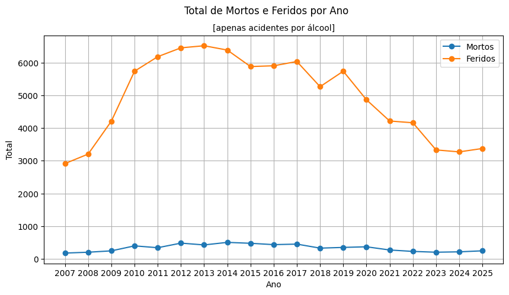
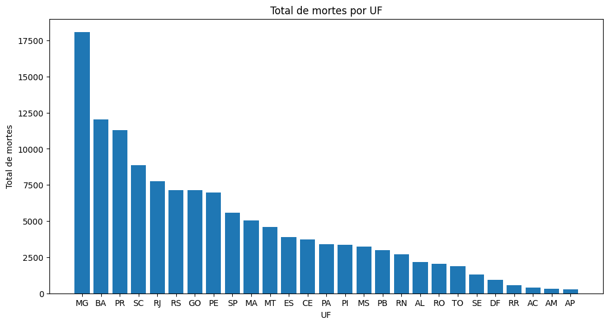
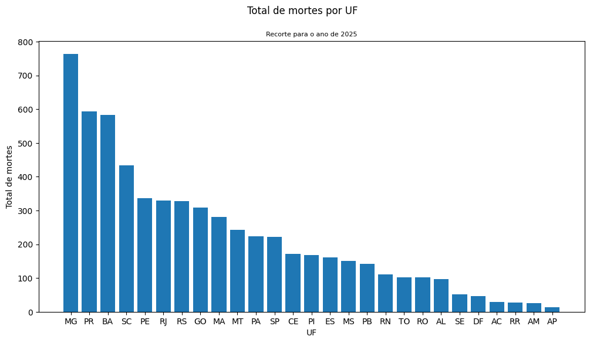
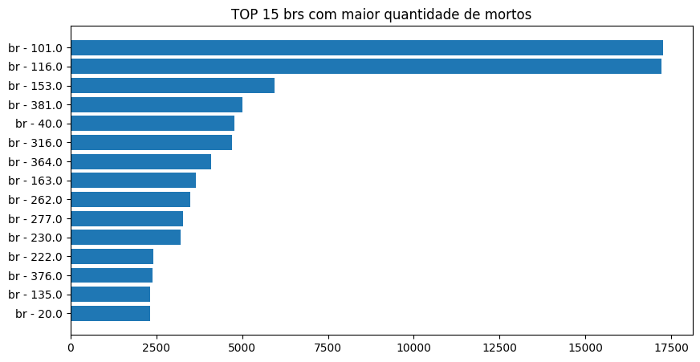
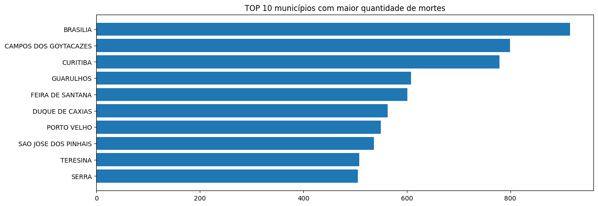
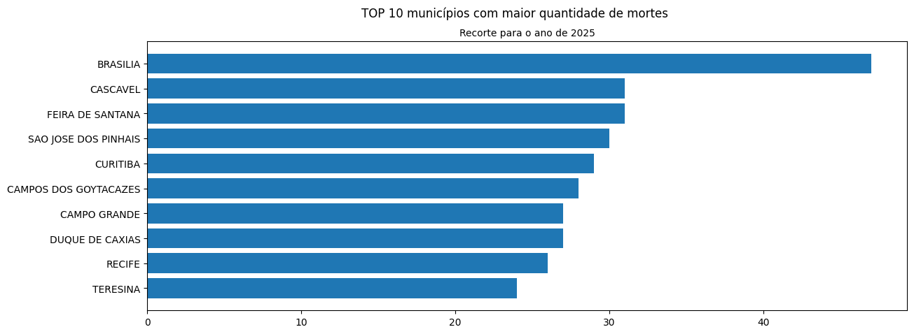
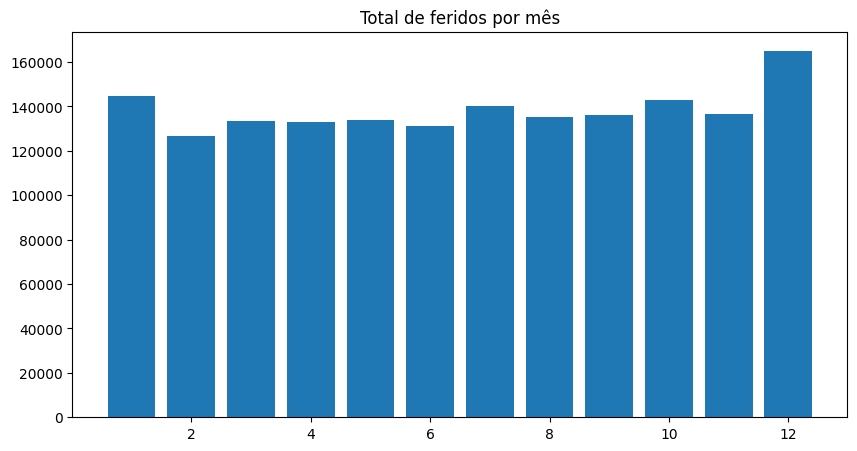
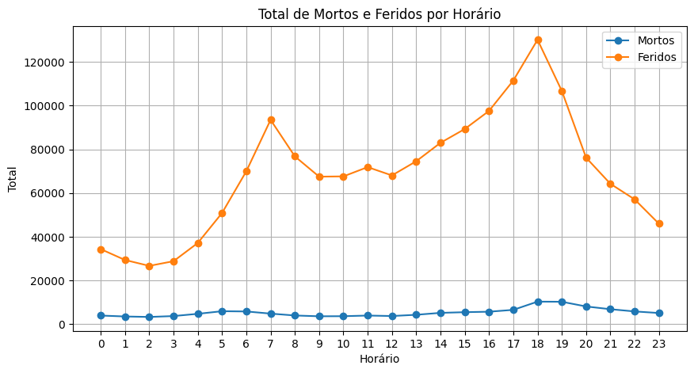
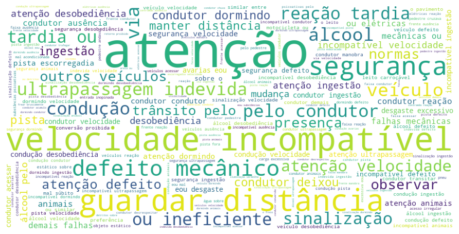
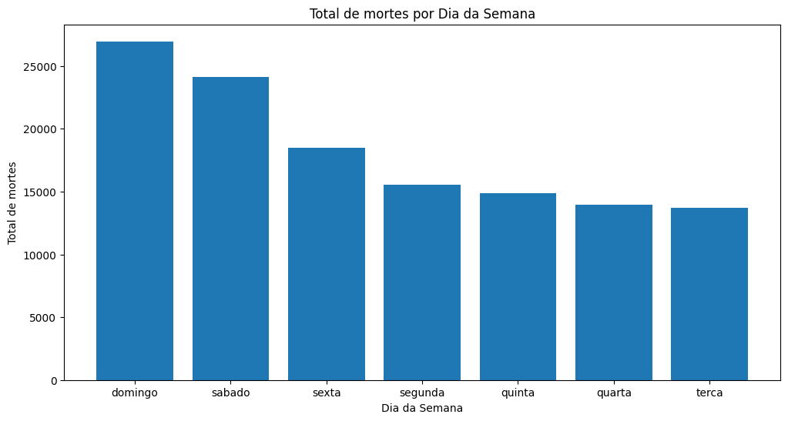

# Análise do histórico de Sinistros nas Rodovias Federais do Brasil \[ 2007 - 2025 ]

## Entendimento do negócio

Este projeto visa prever a quantidade de sinistro nas rodovias do Brasil baseados no dados levantados pela Polícia Rodoviária Federal desde 01/01/2007. 
Este estudo pode nos ajudar a identificar quais rodovias apresentam quantidades excessivas de sinistro para atuar preventivamente e evitar que tais casos ocorram através de ações de educação populacional sobre os riscos da direção de automóveis em rodovias.

### 📊 Dicionário de Dados

| Coluna                 | Tipo          | Descrição                                     |
| ---------------------- | ------------- | --------------------------------------------- |
| id                     | inteiro       | Identificador único do registro do acidente   |
| data_inversa           | string (data) | Data do acidente no formato DD/MM/AAAA        |
| dia_semana             | string        | Dia da semana em que ocorreu o acidente       |
| horario                | string (hora) | Horário do acidente                           |
| uf                     | string        | Unidade Federativa onde ocorreu o acidente    |
| br                     | string        | Rodovia federal (BR)                          |
| km                     | string        | Quilômetro da rodovia onde ocorreu o acidente |
| municipio              | string        | Município do local do acidente                |
| causa_acidente         | string        | Causa principal do acidente                   |
| tipo_acidente          | string        | Tipo do acidente (ex: colisão, capotamento)   |
| classificacao_acidente | string        | Classificação do acidente quanto à gravidade  |
| fase_dia               | string        | Fase do dia (ex: dia, noite, amanhecer)       |
| sentido_via            | string        | Sentido da via no momento do acidente         |
| condicao_metereologica | string        | Condição meteorológica no momento do acidente |
| tipo_pista             | string        | Tipo de pista (simples, dupla, etc.)          |
| tracado_via            | string        | Traçado da via (reta, curva, etc.)            |
| uso_solo               | string        | Uso do solo no local (urbano ou rural)        |
| ano                    | inteiro       | Ano de ocorrência do acidente                 |
| pessoas                | inteiro       | Número total de pessoas envolvidas            |
| mortos                 | inteiro       | Número de vítimas fatais                      |
| feridos_leves          | inteiro       | Número de feridos leves                       |
| feridos_graves         | inteiro       | Número de feridos graves                      |
| ilesos                 | inteiro       | Número de pessoas sem ferimentos              |
| ignorados              | inteiro       | Número de pessoas com estado ignorado         |
| feridos                | inteiro       | Total de pessoas feridas                      |
| veiculos               | inteiro       | Número de veículos envolvidos                 |

## Entendimento dos dados

Os dados podem ser baixados através do portal de dados abertos do Governo Federal. Cada base fica disponível em uma pasta compactada (.zip). Abaixo segue as informações para quem deseja fazer o download das informações:

- Fonte: https://dados.gov.br/dados/conjuntos-dados/sinistros-de-transito-agrupados-por-ocorrencia
- E-mail da área técnica: direx@prf.gov.br

Arquivos: 

1. Cada extração dos anos deve está localizada na pasta arquivos descompactados (*devido ao tamanho dos arquivos passar do limite permitido, eles não foram inclusos na pasta*)
3. Os arquivos *municipio_tse_ibge.csv e leiame- municipio_tse_ibge.pdf* contém os dados referentes aos códigos de IBGE para UF e MUNICÍPIO 
4. O arquivo *lista_municipios_sem_correspondencia.xlsx* contém os municípios e seus códigos ao qual não obtiveram correspondência com a base do histórico de sinistros

Códigos utilizados:

- eda.py
- unzip_files.py

Através dos dados, vamos buscar prever a quantidade de feridos nos sinistros das rodovias brasileiras. Após conseguirmos prever, será aplicado uma série temporal a partir da agregação de mês. A ideia é tentar responder a seguinte pergunta: 

**Conseguimos prever a quantidade de feridos a partir do histórico para o 1º semestre do ano de 2026?**

Para isso foram exploradas as seguintes análises:

1. Qual é o cenário pós implementação da Lei seca (2008) de feridos e mortos nas rodovias federais

2. Principais ufs, brs e municípios com maior quantidade de número de mortos

**UF**

- Considerando todo o histórico dos anos de 2007 até 2025

- Considerando apenas o ano de 2025

**brs**

**Municípios**

- Considerando todo o histórico dos anos de 2007 até 2025

- Considerando apenas o ano de 2025

3. Quantidade de feridos num período de meses, anos e horário

- meses 

- horário

4. Quais as principais causas de acidentes através da nuvem de palavras

5. Quais são os dias da semana com maior quantidade de feridos

6. Análise da permanência dos outliers (números acima da média devido aos desastres nas rodovias)

Foram encontradas reportagens que comprovam os acidentes com número de pessoas acima de 100. Sendo assim, foi escolhido a permanência dos casos para serem considerados no treinamento do modelo.

## Preparação dos dados

1. Criação de colunas a partir da data_inversa: data, meses, ano
2. Ajuste nas padronizações dos valores categóricos para numéricos: latitude, longitude, br, km
3. Remoção de colunas que não estão presentes no histórico: regional, delegacia, uop, latitude e longitude
4. Padronização dos valores categóricos: fase_dia, condicao_metereologica
5. Remoção das colunas que causam vazamento de informações
6. Transformação das colunas categóricas em numéricas

Códigos utilizados:

- data_prep.py
- preparation_final_data.py

## Modelagem

Aplicação dos modelos para regressão: 

- GradientBoosting (modelo_gradient_boosting.pkl)
- Random Forest (modelo_random_forest.pkl)
- Decision Tree (modelo_decision_tree.pkl)

Código com os modelos:

- train.py

## Avaliação dos modelos

- evaluation_code.py

*resultado encontrado para o conjunto de validação*

| Modelo | MAE ↓ | RMSE ↓ | R² ↑ | Desempenho |
|--------|------|-------|-----|-------------|
| Gradient Boosting | 0.4662 | 1.1183 | 0.1712 | 🟢 Melhor |
| Random Forest | 0.5731 | 1.1329 | 0.1494 | 🟡 Bom |
| Decision Tree | 0.6675 | 1.7261 | -0.9747 | 🔴 Ruim |

*resultado encontrado para o conjunto de teste*

| Modelo | MAE ↓ | RMSE ↓ | R² ↑ | Desempenho |
|--------|------|-------|-----|-------------|
| Gradient Boosting | 0.4586 | 1.0886 | 0.1775 | 🟢 Melhor |
| Random Forest | 0.5663 | 1.1072 | 0.1491 | 🟡 Bom |
| Decision Tree | 0.6586 | 1.6818 | -0.9630 | 🔴 Ruim |

## Visualização dos gráficos

- vizualization (pasta)

## Código principal 

- main.py

*visualização dos resultados* : saida_treinamento_validacao.txt